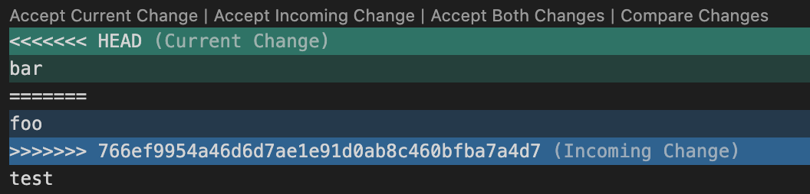
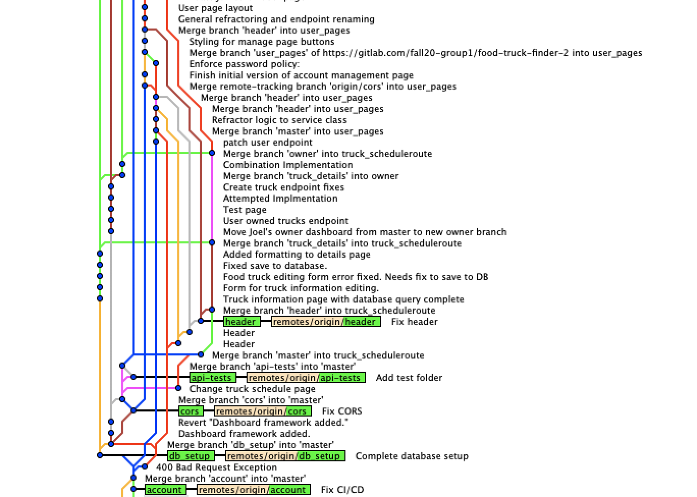
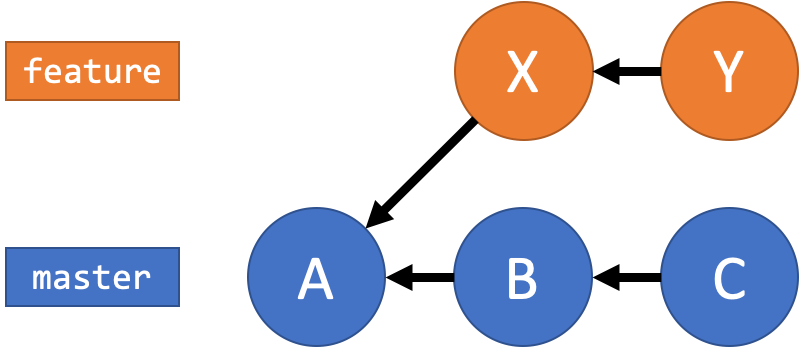
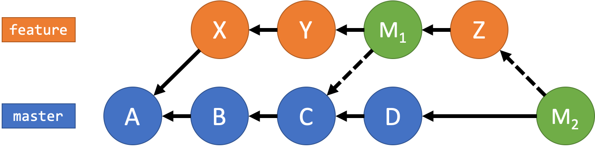
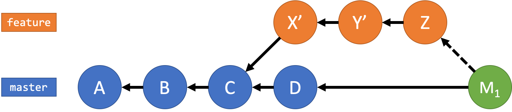

# Git Workshop

_This workshop was originally designed for use for Computing for Compassion. Feel free to use or reference for your own purposes!_

_Revised October 2020._

## Table of Contents

<!-- START doctoc generated TOC please keep comment here to allow auto update -->
<!-- DON'T EDIT THIS SECTION, INSTEAD RE-RUN doctoc TO UPDATE -->
<details>
<summary>Table of Contents</summary>

- [Motivation for Git](#motivation-for-git)
- [Key Terminology](#key-terminology)
- [Setting up Git](#setting-up-git)
  - [Using the command-line](#using-the-command-line)
    - [Installing for macOS](#installing-for-macos)
    - [Installing for Windows](#installing-for-windows)
    - [Intial setup](#intial-setup)
  - [Using a Git GUI](#using-a-git-gui)
    - [Pick a GUI](#pick-a-gui)
- [Creating a Git repository](#creating-a-git-repository)
- [Our first commit](#our-first-commit)
- [Getting information before and after committing](#getting-information-before-and-after-committing)
  - [`git diff`](#git-diff)
  - [`git log`](#git-log)
  - [`git show`](#git-show)
- [Pushing to a remote](#pushing-to-a-remote)
  - [Creating a remote repository](#creating-a-remote-repository)
  - [Linking your local repo to the remote](#linking-your-local-repo-to-the-remote)
  - [`git remote`](#git-remote)
  - [`git push`](#git-push)
- [Collaboration using Git](#collaboration-using-git)
- [Merging, Part I](#merging-part-i)
  - [Simple Merge](#simple-merge)
  - [Merge Conflict](#merge-conflict)
- [Branching](#branching)
- [Merging, Part 2](#merging-part-2)
  - [Quick tip: Feature Branching](#quick-tip-feature-branching)
- [Intermediate: Undoing](#intermediate-undoing)
- [Intermediate: The `.gitignore` file](#intermediate-the-gitignore-file)
- [Intermediate: Stashing](#intermediate-stashing)
- [Advanced: Tagging](#advanced-tagging)
- [Advanced: Rebasing](#advanced-rebasing)
- [Advanced: Cherry-picking](#advanced-cherry-picking)
- [Intermediate: Using GitHub](#intermediate-using-github)
  - [Issues](#issues)
  - [Pull Requests](#pull-requests)
  - [The `README.md` file](#the-readmemd-file)
  - [GitHub Profile `README`](#github-profile-readme)

</details>
<!-- END doctoc generated TOC please keep comment here to allow auto update -->

## Motivation for Git

[Back to Table of Contents](#table-of-contents)

TODO: 

## Key Terminology

[Back to Table of Contents](#table-of-contents)

A **Version Control System (VCS)** is a software tool that helps record changes to file(s) by recording individual modifications to files in an organized and easily-available way. It contains _all_ of the edits and history of each file.

In Git, the basic atomic unit of work is called a **commit**. Commits are _snapshots_ of your file structure and contents at a particular point in time (this is in contrast to other VCSs, where basic records of changes are based on _diffs_ (will be described later on)).

Sets of commits are contained in **repositories** (**repos**, for short), which records the history of edits for a single project. There are two different types of repositories: **local repositories** and **remote repositories**. A local repository is the repository contained _on your local machine_. A remote repository, in contrast, is the history stored on an external machine, usually in the cloud somewhere (e.g., [GitHub](https://github.com/), [GitLab](http://gitlab.com/), [Bitbucket](https://bitbucket.org/)). Many local repositories (multiple computers, users, etc.) all link to usually one remote repository. For Git, the local repository is stored in the `.git` folder in the project directory.

In Git, there are four groups that a file (specifically, the changes to a file) can be in. The latter three are considered to be "tracked files" or, in other words, files that Git is keeping tabs on.

- **Untracked Files**: files that have not yet been recognized by Git and whose version histories are not being tracked.
- **Working Directory**: files that are being tracked by Git but whose changes have not been staged yet.
- **Staging Area (Index)**: file changes that are "staged" (ready to commit).
- **History (Repository)**: committed file changes that are "permanent".

## Setting up Git

[Back to Table of Contents](#table-of-contents)

### Using the command-line

The command-line is a powerful tool and allows you to have full control over your project. However, this comes with the drawback of not having other warning and error-checking information that a GUI could provide.

#### Installing for macOS

For macOS, I recommend installing Git through `homebrew`:

1. If `homebrew` is not installed, open `Terminal.app` and copy-and-paste the following command:

```sh
/bin/bash -c "$(curl -fsSL https://raw.githubusercontent.com/Homebrew/install/master/install.sh)"
```

2. After `homebrew` is installed, run the following command:

```sh
brew install git
```

#### Installing for Windows

For Windows, simply go to the [download link](https://git-scm.com/download/win).

#### Intial setup

Run the following commands in your terminal / command prompt (replace your name and email accordingly).

```sh
git config --global user.name "Your Name"
git config --global user.email your.email.address@example.com
```

**Important note: the email address used here _must_ match the one used in your GitHub or GitLab account. Otherwise, the commits that you author will not be linked to your account.**

### Using a Git GUI

GUIs are often preferred by beginners due to their simplicity and ease-of-use. However, they can be insufficient for common tasks.

#### Pick a GUI

I personally recommend either [GitHub Desktop](https://desktop.github.com/) or [Sourcetree](https://www.sourcetreeapp.com/). Note that they were built to integrate with GitHub and Bitbucket, respectively, but can be used with either.

## Creating a Git repository

[Back to Table of Contents](#table-of-contents)

The command `git init` will initialize a Git repository in the directory that you are in. Thus, if you want to initialize a project from scratch, first make a new directory and then run this command inside of it. If you are creating a repository from existing sources, just enter the folder and run `git init`.

_Follow along!_

```sh
mkdir git-workshop-1
cd git-workshop-1
git init
```

## Our first commit

[Back to Table of Contents](#table-of-contents)

Before we can commit any files, we have to create a file! Let's start there.

First, create a file called `hello-world.cpp`, seen below.

```c++
#include <iostream>

using namespace std;

int main() {
    cout << "hello world" << endl;

    return 0;
}
```

Next, run the command `git status` to see the status of the current project. You should get output like the following:

```
On branch master

No commits yet

Untracked files:
(use "git add <file>..." to include in what will be committed)

    hello-world.cpp

nothing added to commit but untracked files present (use "git add" to track)
```

Notice how Git saw that `hello-world.cpp` has been created and that it is under the "Untracked files" category. This means that the file exists but that Git has not started keeping track of changes to it.

Next, run the command `git add hello-world.cpp`. This causes the file to be **staged**. Running `git status` again will show this:

```
On branch master

No commits yet

Changes to be committed:
  (use "git rm --cached <file>..." to unstage)

	new file:   hello-world.cpp
```

`hello-world.cpp` has just moved from the **working directory** to the **staging area** or **index**. The staging area contains files that are about to be committed, in essense answering the question of "which file changes do I want to be recorded in the next snapshot?" Note that this command will _only move the current changes_ to the staging area. If you change the file again after `git add`ing it, you must run `git add` again.

Next, run `git commit -m "Initial commit"`. This command takes all of the "staged" changes and bundles them together into a single snapshot called a "commit". Note that, behind the scenes, what is really happening is that the previous commit (snapshot) is being editing according to the changes specified in the commit. The `-m` flag in the command specifies the **commit message**, a short description of the changes that occurred. In this case, we said "Initial commit" since this was the first commit to our repository.

When we run this command, we should see the following output:

```
[master (root-commit) d1fcb41] Initial commit
 1 file changed, 9 insertions(+)
 create mode 100644 hello-world.cpp
```

There is a lot of information here for us to see. First, we see the **branch** that we are on (`master`). We can also see the **short commmit hash** (the unique identifier of the commit). In my case, it is `d1fcb41`. Note that the actual commit hash is much longer! But, for simplicity, only the first 7 characters are shown as they are usually enough to uniquely identify the commit.

Now, if we run `git status`, we should see the following indicating that there are no more changes that are not committed or "saved" (i.e., the working tree (directory) is "clean"):

```
On branch master
nothing to commit, working tree clean
```

## Getting information before and after committing

[Back to Table of Contents](#table-of-contents)

Before we move on, I want to point out a few commands that come in handy.

First, create the file `goodbye-planet.cpp` as seen below:

```c++
#include <iostream>

using namespace std;

int main() {
    cout << "Goodbye, planet!" << endl;

    return 0;
}
```

Then, edit `hello-world.cpp` to change the `"hello world"` string to be `"Hello, world!"`.

### `git diff`

`git diff` is a command that will compare the versions of files. In its basic form, it will compare the _working directory_ to your _staging area and committed changes_. If we run `git diff` now, we will see the following:

```
diff --git a/hello-world.cpp b/hello-world.cpp
index 15b85dd..9155c1e 100644
--- a/hello-world.cpp
+++ b/hello-world.cpp
@@ -3,7 +3,7 @@
 using namespace std;
 
 int main() {
-    cout << "hello world" << endl;
+    cout << "Hello, world!" << endl;
 
     return 0;
 }
```

First notice that there is no mention of `goodbye-planet.cpp` here. That is because `goodbye-planet.cpp` is **untracked**, so, correspondingly, there is no information to compare against.

**Git analyzes changes on a line-by-line basis**. This is seen by the fact that the line that we changed in `hello-world.cpp` is marked with a `-` and `+`. The `-` indicates the _previous_ version and the `+` indicates the _new_ version.

### `git log`

`git log` tells you about _all_ of the commits in your repository. Before we run this command, let's commit our changes using `git add .`. The `.` in this command refers to the _current directory_. Git then recursively searches through the file tree from this folder and looks for any files that have been changed.

Use `git add .` and then commit your changes. Commit messages should be consise and descriptive. A good message for this change could be `Add 'Goodbye, Planet!' file and fixed punctuation`.

After committing, run `git log` to see what you see:

```
commit 81687546714d7dcb7a1c7eba75ea2207f7126cdb (HEAD -> master)
Author: Matthew McCaskill <mattrmccaskill@gmail.com>
Date:   Sun Oct 18 13:21:01 2020 -0500

    Add 'Goodbye, planet!' file and fixed punctuation

commit d1fcb4137d79b92fdac864a7be1a3bcd93356275
Author: Matthew McCaskill <mattrmccaskill@gmail.com>
Date:   Sun Oct 18 12:35:04 2020 -0500

    Initial commit
```

Here we see each commit in _reverse chronological order_. We can also see the full 40-character commit hash, the author of the commit (which should be your name and email), the date and time of the commit, and the commit message.

Something else to notice is the `HEAD ->` on the first line. `HEAD` is a special name for the last commit on your current branch. In reality, it is a pointer to the latest commit on your currently-checked out branch (we will talk more about this later).

### `git show`

`git show` can be used to find out more information about a commit.

Running `git show` by itself will show you information about the previous commit, as seen below. Basically `git show` shows us _both_ the `git log` information _and_ the `git diff` information. Cool, right!

```
commit 81687546714d7dcb7a1c7eba75ea2207f7126cdb (HEAD -> master)
Author: Matthew McCaskill <mattrmccaskill@gmail.com>
Date:   Sun Oct 18 13:21:01 2020 -0500

    Add 'Goodbye, planet!' file and fixed punctuation

diff --git a/goodbye-planet.cpp b/goodbye-planet.cpp
new file mode 100644
index 0000000..4036788
--- /dev/null
+++ b/goodbye-planet.cpp
@@ -0,0 +1,9 @@
+#include <iostream>
+
+using namespace std;
+
+int main() {
+    cout << "Goodbye, planet!" << endl;
+
+    return 0;
+}
diff --git a/hello-world.cpp b/hello-world.cpp
index 15b85dd..9155c1e 100644
--- a/hello-world.cpp
+++ b/hello-world.cpp
@@ -3,7 +3,7 @@
 using namespace std;
 
 int main() {
-    cout << "hello world" << endl;
+    cout << "Hello, world!" << endl;
 
     return 0;
 }
```

In addition, you can use `git show [hash]` to see the information of a _specific_ commit. In my case, I run the command `git show d1fcb4137d79b92fdac864a7be1a3bcd93356275` (the commit hash of "Initial commit"):

```
commit d1fcb4137d79b92fdac864a7be1a3bcd93356275
Author: Matthew McCaskill <mattrmccaskill@gmail.com>
Date:   Sun Oct 18 12:35:04 2020 -0500

    Initial commit

diff --git a/hello-world.cpp b/hello-world.cpp
new file mode 100644
index 0000000..15b85dd
--- /dev/null
+++ b/hello-world.cpp
@@ -0,0 +1,9 @@
+#include <iostream>
+
+using namespace std;
+
+int main() {
+    cout << "hello world" << endl;
+
+    return 0;
+}
```

## Pushing to a remote

[Back to Table of Contents](#table-of-contents)

Remote repositories are what make Git a powerful collaborative tool. Before we continue, we need to create a remote repository.

### Creating a remote repository

**Make sure you have an account created on GitHub for this next step.**

Create a new repository on GitHub by clicking the "+" button in the top-right corner.


Next, choose a meaningful name and description for your repository and click the "Create repository" button.


### Linking your local repo to the remote

GitHub has a great feature that gives you some commands for specific situations. In this case, we are going to run the commands in the "…or push an existing repository from the command line" section:


There are two commands of interest here: `git remote` and `git push`.

### `git remote`

First, run the following command, substituting where appropriate:

```sh
git remote add origin https://github.com/[GitHub username]/[repo name].git
```

You can simply copy the link from the GitHub page if you wish. This command will tell your local Git repository that the remote repository named `origin` is the GitHub repo you just created. `origin` is the standard name referring to the main remote of your project. You will only need to do this once per project, per remote (you usually only have one remote anyway).

### `git push`

`git push` is the other important command here. `git push` takes all of your local commits and sends them to the remote repository for storage. You will need to do this any time that you want to update the remote repository (which is usually pretty often).

Run `git push`. You will likely see the following:

```
fatal: The current branch master has no upstream branch.
To push the current branch and set the remote as upstream, use

    git push --set-upstream origin master

```

Here, Git is telling us that our local branch `master` has no "upstream" branch. An "upstream" branch is simply the remote branch which your local one will mirror.

Follow Git's advice and run the command: `git push --set-upstream origin master`. You should see the following afterwards:

```
Enumerating objects: 7, done.
Counting objects: 100% (7/7), done.
Delta compression using up to 8 threads.
Compressing objects: 100% (6/6), done.
Writing objects: 100% (7/7), 2.09 KiB | 2.09 MiB/s, done.
Total 7 (delta 0), reused 0 (delta 0)
To https://github.com/ZekNikZ/git-workshop-demo.git
 * [new branch]      master -> master
Branch 'master' set up to track remote branch 'master' from 'origin'.
```

This says that your `master` branch is now set up to track the `master` branch in the `origin` remote.

Open up GitHub to see if your code did indeed sync:


## Collaboration using Git

[Back to Table of Contents](#table-of-contents)

By far, the most useful feature of Git is its focus on collaboration. There are four main commands of interest here: `git clone`, `git push`, `git fetch`, and `git pull`.

- `git clone` sets up a new local repository which will track a specified remote.
  - Note: this is functionally equivalent to the following:
    - `git init`
    - `git remote add origin [url]`
    - `git pull`
- As you already know, `git push` will push the commits in your local repository to the remote repository.
- `git fetch` will grab information from the remote so that your local repository knows which of your branches are behind and which are ahead.
- `git pull` will "pull" in the commits from the remote into your local repository.

Let's see all of these in an example. We are going to create a second local repository tracking the same remote to simulate multiple users working on the same project.

First, open a new terminal/command prompt instance _in the directory which you want to contain the new local repository_. In my case, opened a terminal at the Destkop.

Next, run the following command to create a new local repository. You can again copy the URL from your repository page. The `[folder name]` refers to the name of the folder that you want to put your project into. In my case, I want to put it into a new folder called `git-workshop-2`.

```sh
git clone https://github.com/[GitHub username]/[repo name].git [folder name]
```

In my case, my command looked like this: `git clone https://github.com/ZekNikZ/git-workshop-demo.git git-workshop-2`.

Open up `git-workshop-2/` and you should see the two files from before! If so, it worked! **I recommend keeping both folders open and both terminal windows open for the remainder of the workshop. I will refer to the repositories as "local repository 1" (original), "local repository 2" (new), and "remote repository" for the remainder of this workshop.**

In **local repository 1**, create a new file called `test.txt`. Put whatever you want inside of it. Stage and commit this file. This is how I did it:

```sh
echo 'Hello, world!' > test.txt
git add .
git commit -m "collaboration test file"
```

Now, we will do a `git push`. This will push the change to the _remote repository_.

Now, in **local repository 2**, run `git fetch`. You should see something similar to this:

```
remote: Enumerating objects: 4, done.
remote: Counting objects: 100% (4/4), done.
remote: Compressing objects: 100% (1/1), done.
remote: Total 3 (delta 1), reused 3 (delta 1), pack-reused 0
Unpacking objects: 100% (3/3), done.
From https://github.com/ZekNikZ/git-workshop-demo
   8168754..267dc33  master     -> origin/master
```

This indicates that Git pulled the commit from local repository 1 into your local repository 2. In fact, if you run `git fetch` again, you will not have any output this time. This is because there were no more changes to fetch.

Next, run `git pull`. This will pull in the new file `text.txt` to your local repository 2. Here is the expected output from `git pull`:

```
Updating 8168754..267dc33
Fast-forward
 test.txt | 1 +
 1 file changed, 1 insertion(+)
 create mode 100644 test.txt
```

When you run `git pull`, it gives you a summary of what has changed. In this case, we can see that `test.txt` was created. If you run `git pull` again, you will see `Already up to date.`, indicating that there were no changes this time.

Before we move on, let's run `git log` again. You should get output similar to the following:

```
commit 267dc33c259dcd168ef6a0a57ecb3c1e7e406c42 (HEAD -> master, origin/master, origin/HEAD)
Author: Matthew McCaskill <mattrmccaskill@gmail.com>
Date:   Sun Oct 18 14:39:23 2020 -0500

    collaboration test file

commit 81687546714d7dcb7a1c7eba75ea2207f7126cdb
Author: Matthew McCaskill <mattrmccaskill@gmail.com>
Date:   Sun Oct 18 13:21:01 2020 -0500

    Add 'Goodbye, planet!' file and fixed punctuation

commit d1fcb4137d79b92fdac864a7be1a3bcd93356275
Author: Matthew McCaskill <mattrmccaskill@gmail.com>
Date:   Sun Oct 18 12:35:04 2020 -0500

    Initial commit
```

Look closely at the first commit there. We see that the latest commit is the current `HEAD` of the `master` branch, the `origin/master` branch (the `master` branch in the `origin` remote), and the `HEAD` of the `origin` remote. We'll talk more about this later, but keep this in mind for now.

## Merging, Part I

[Back to Table of Contents](#table-of-contents)

Now, let's see what happens when two individual users both make some changes at the same time.

### Simple Merge

In **local repository 1**, create the file `merge-A.txt`. Stage, commit, and push.

In **local repository 2**, create the file `merge-B.txt`. Stage and commit.

Now, still in local repository 2, try pushing (`git push`). It will complain with the following error message:

```
To https://github.com/ZekNikZ/git-workshop-demo.git
 ! [rejected]        master -> master (fetch first)
error: failed to push some refs to 'https://github.com/ZekNikZ/git-workshop-demo.git'
hint: Updates were rejected because the remote contains work that you do
hint: not have locally. This is usually caused by another repository pushing
hint: to the same ref. You may want to first integrate the remote changes
hint: (e.g., 'git pull ...') before pushing again.
hint: See the 'Note about fast-forwards' in 'git push --help' for details.
```

Basically, Git is complaining that another commit happened in the process of making our change and suggests to do a `git pull` before pushing again. In practice, it is highly recommended to _always_ pull before pushing for this exact reason.

Do a `git pull` now and Git will prompt you to **merge**. A merge takes the commits of one branch and applies them to another. In this case, we are merge the two sub-branches of `master` caused by us making separate commits. When the prompt opens, simply save the file using `^X` in `nano` or `:wq` in `vim` to pull. Then you will be able to `git push`.

Keep in mind that **merges are also commits**, so you will need to `git pull` in local repository 1.

### Merge Conflict

Now, edit `test.txt` in the following ways:

- In **local repository 1**, change the first line to `foo` and the second line to `test`.
- In **local repository 2**, change the first line to `bar` and the second line to `test`.

Think about what we just did here. We modified the _same_ part of the file in two different ways. Go ahead and stage, `commit` and `push` the changes from local repository 1.

Now, in **local repository 2**, stage and `commit` as before and try to `push`. You should get the same error as before. Remembering to `git pull` before `git push`ing, do a `git pull`.

This time, you will get a message like the following:

```
Auto-merging test.txt
CONFLICT (content): Merge conflict in test.txt
Automatic merge failed; fix conflicts and then commit the result.
```

This message is saying that there was a merge conflict, meaning two separate branches modified the same line of a file in different ways. There are three steps to **resolving** a merge conflict:

1. Open the file in question and resolve the conflict.
2. Stage the change.
3. Commit the merge.

If you think about it, these three steps are obvious. If there is a conflict, we first need to resolve it, then, since we made a change, we need to stage and commit it. So, let's do it:

First, open `test.txt` and look inside. You will see something like this:

```
<<<<<<< HEAD
bar
=======
foo
>>>>>>> 766ef9954a46d6d7ae1e91d0ab8c460bfba7a4d7
test
```

Depending on your text editor, it may recognize that this is a merge conflict and help you out, like Visual Studio Code:



But, let's try resolving it manually. Everything between `<<<<<<< HEAD` and `=======` is **your** change (i.e., the change that you did on your current sub-branch). Everything between `=======` and `>>>>>>> [hash]` is **their** change (i.e., the other change that conflicts with this one). The `[hash]` is the hash of the commit which caused the conflict.

To manually resolve the change, simply keep what you want and remove the `<<<<<<< HEAD`, `=======`, and `>>>>>>> [hash]`. In this case, let's keep _their_ change. Leave your file like this:

```
foo
test
```

Next, stage, commit, and push. Congradulations! You have resolved your first merge conflict!

**Note that it is perfectly fine to keep _both_ or _neither_ of the sides of the merge conflict. Also, it is possible to have multiple conflicts in the same file, so be careful to check the whole file thoroughly.**

## Branching

[Back to Table of Contents](#table-of-contents)

Now that we have a foundational understanding of committing, merging, pushing, and pulling, we can start talking about **branching**. Branching is perhaps the most important thing to learn in Git in terms of managing a complex project.

Up until now, everything we have done has been on the `master` branch. Remember that a Git project looks kind of like a tree, so the `master` branch essentially acts as the "trunk." All other branches are offshoots which add a specific subset of functionality to the project. In most cases, these other branches are `merge`d back into `master` after their work has been completed, but there are some instances that this may not be the case—two notable execptions being documentation branches and GitHub pages.

First, run `git branch` to see all of branches that you have in your project. You should only see `* master`. The `*` indicates what branch you are currently on. In general, `git branch` will give you a list of the branches in your project _and_ tell you which one your `HEAD` is currently on—i.e., which one your current working directory is mirroring _and_ what branch a new commit will go onto.

That last point is very important; any commits that you create will go onto the _currently checked-out branch_. When a branch is said to be **checked-out**, it just means that that branch is the one that is reflected in the working directory.

Let's start our journey of branches by creating a new branch in local repository 1:

- Run the command `git branch my-first-branch` to create a new branch called `my-first-branch`.
- Run `git branch` again and you should see both `master` and `my-first-branch` in the list. However, `master` is still selected. So...
- Run `git checkout my-first-branch` to switch to `my-first-branch`. You can then run `git branch` again to confirm the switch.
- **Important note: this is not the usual way of creating branches. Since you almost always want to swap to the created branch when making a new one, use instead `git checkout -b branch-name` to create a new branch and immediately switch to it.**

Now that we have a new branch, look around in your project folder. Do you see anything different? You shouldn't. Simply creating the branch does not do much; instead, the act of _committing_ to a branch is what starts the diverging trees of a Git repository. So, let's make a commit!

First, edit the file `test.txt` by adding a new line with your name. In my case, I added the line containing `Matthew` to the end of `test.txt`.

Next, commit the change and run `git log`. The top of the output should now look like this:

```
commit 787c6717052fea0841a775b41b5b4dcc3b823f4a (HEAD -> my-first-branch)
Author: Matthew McCaskill <mattrmccaskill@gmail.com>
Date:   Sun Oct 18 22:39:34 2020 -0500

    Added name to test file

commit 766ef9954a46d6d7ae1e91d0ab8c460bfba7a4d7 (origin/master, master)
Author: Matthew McCaskill <mattrmccaskill@gmail.com>
Date:   Sun Oct 18 15:37:21 2020 -0500

    Merge Conflict A

commit cfda0bd18a103de63416ebabdb6e9c966bbc00b3
Merge: d4fb836 b5ce628
Author: Matthew McCaskill <mattrmccaskill@gmail.com>
Date:   Sun Oct 18 15:27:15 2020 -0500

    Merge branch 'master' of https://github.com/ZekNikZ/git-workshop-demo

```

Notice two things. First, `my-first-branch` is listed as the branch for our most recent commit. **This is because all commits go onto the currently checked-out branch**. Second, notice that `HEAD` is pointing to our new branch instead of `master`. This is because the working directory is described by `my-first-branch` now after the `git checkout` command.

Now, let's push this new branch to our remote repository. Simply do a `git push` and look at the output:

```
fatal: The current branch my-first-branch has no upstream branch.
To push the current branch and set the remote as upstream, use

    git push --set-upstream origin my-first-branch

```

This is exactly the same problem that we had when we first tried to push `master` to the remote repository! So, as before, run the suggested command but note that from this point forward, you no longer need to specify `--set-upstream origin my-first-branch` for this branch. After doing this command once per branch, you can simply run `git push` to push the current branch.

## Merging, Part 2

[Back to Table of Contents](#table-of-contents)

At this point, you should have local repository checked out on `my-first-branch` and local repository 2 checked out on `master`. What happens when we want to take the changes from our branch and _merge_ them back into `master`?

First, in **local repository 2**, run `git fetch`. You should see output indicating that the Git repository knows about a new branch from `origin`. Now run `git pull` to update our `master` branch before merging.

The `git merge <source branch>` command allows us to take the commits in a branch and apply them to another. Notice however, that the command only specifies one branch, the **source** branch. The **target** or **destination** branch is always that branch that you are currently on (currently have checked out). So, there are two cases we want to consider:

- If we want to merge `my-first-branch` _into_ `master` (so that `master` gets any new changes from `my-first-branch`):
  - Check out `master` if you haven't already.
  - Run `git merge my-first-branch`
- If we want to merge `master` _into_ `my-first-branch` (so that `my-first-branch` gets any new changes from `master`):
  - Check out `my-first-branch` if you haven't already.
  - Run `git merge master`

In our case, we want to merge `my-first-branch` into `master`, so run `git merge my-first-branch`. You should get this output:

```
merge: my-first-branch - not something we can merge

Did you mean this?
	origin/my-first-branch
```

Since we never `git checkout`ed `my-first-branch` in local repository 2, it does not know about what commits were on that branch. So, the simple solution is to follow Git's advice and simply run `git merge origin/my-first-branch` instead. Now, if we check `git log`, we should see that `master` now has the commit of `my-first-branch`.

```
commit 787c6717052fea0841a775b41b5b4dcc3b823f4a (HEAD -> master, origin/my-first-branch, my-first-branch)
Author: Matthew McCaskill <mattrmccaskill@gmail.com>
Date:   Sun Oct 18 22:39:34 2020 -0500

    Added name to test file

commit 766ef9954a46d6d7ae1e91d0ab8c460bfba7a4d7 (origin/master, origin/HEAD)
Author: Matthew McCaskill <mattrmccaskill@gmail.com>
Date:   Sun Oct 18 15:37:21 2020 -0500

    Merge Conflict A

...
```

Notice that `origin/master` and `origin/HEAD` are still at the previous commit. This is because we have not pushed this update to the repository tree. Go ahead and `git push` now.

### Quick tip: Feature Branching

There two several primary methods to branching worth mentioning at this point in time:

1. User branching: each branch represents the work of a single _user_ (bad)
2. Feature branching: each branch represents the work of a single _feature_ (good)

Since Git is meant to be collaborative, it makes sense why user branching is such a bad idea. It implies both one user _only_ should be working on a single branch at a time and that they should a user should work on only _one_ branch at a time. In practice, this is obviously not the case, but I wanted to mention it as something to _not_ do.

Feature branching is the primary purpose of branching in smaller collaborative projects. A single, isolated feature that is developed independently of any other features is put on a branch by itself. This allows development to be cohesive and have low coupling in development.

For an example of a feature branch, consider a platforming game (like Mario). I may create a separate branch to add a new enemy to the game (such as a Goomba). Enemies are independant of every other feature in the game, so can be developed independantly.

For a list of a few more different types of branching methods, check out [this article](https://backlog.com/git-tutorial/branching-workflows/).

## Intermediate: Undoing

[Back to Table of Contents](#table-of-contents)

Since undoing is completely situation-dependent and rare, what follows is a simple quick-reference sheet for common "undo" operations in different contexts:

- **Un-staging a file.**
  - `git rm --cached <file>`: un-stage a file
- **Undoing changes _before_ committing.**
  - `git checkout <file>`: reset file to `HEAD`
  - `git checkout HEAD`: reset working directory to `HEAD`
  - `git checkout <object> [file]`: reset working directory or `file` to `object` (commit, branch, etc.)
- **Undoing changes _after_ committing but _before_ pushing.**
  - Use these forms if you want to undo changes _and nobody else has them yet (you have not pushed_.
  - `git reset <object>`: reset `HEAD` and current branch to `object` (commit, branch, etc.) but put all changes since that commit into working directory.
  - `git reset --hard <object>`: completely reset working directory and history to `object` (commit, branch, etc.) without keeping any history of later commits
- **Undoing changes _affer_ committing but _after_ pushing.**
  - Use these forms if you want to undo changes _that have already been pushed_.
  - `git revert HEAD~<#>`: create commit undoing `#` of commits ago
  - `git revert <object>`: create commit undoing `object` (commit, branch tip, etc.)

## Intermediate: The `.gitignore` file

[Back to Table of Contents](#table-of-contents)

If you create a `.gitignore` file in the root directory of your project, you can specify which directories and files that you want Git to completely ignore and not track at all. There are many reasons to do this:

- Project configuration files for IDEs
  - If you exclude project configuration files, contributors can use any IDEs that they want without conflicts.
- Secret files (secret keys, passwords, etc.)
  - Remember, Git repositories are on the internet and are therefore public! Don't release your secrets!
- Build files
  - Any build files (artifacts, executables, etc.), in general, should NOT be committed as they can be easily re-generated by anyone who clones your project.

Basic syntax for a `.gitignore` file is as follows:

```gitignore
# This is a comment, Git will ignore this line

# Ignore specific files
specificFile.txt
data/specificFile.csv

# Globbing (wildcards)
# * - 0 or more characters
# ? - 0 or 1 character
# [a-z] - any character in this range
*.secret
test?.txt
names_that_start_with_[a-z].csv

# Ignore directory called "build"
build/

# Ignore files or directories called "build"
build

# Ignore everything in folder
build/**

# Match all "test.txt" files inside of a folder
**/test.txt

# Match all "bar" directories inside of a "foo" directory
**/foo/bar/
```

View [the manual](https://git-scm.com/docs/gitignore) for more information.

**I highly recommend the website called [gitignore.io](https://gitignore.io/) for generating `.gitignore` files. You can specify the programming language and IDEs that you and your team are using and it will dynamically generate a simple `.gitignore` file!**

## Intermediate: Stashing

[Back to Table of Contents](#table-of-contents)

Here's a good theoretical question: what happens when I try to `git pull` when there are some local changes (not committed) which conflict with the pulled changes? Let's find out!

Before starting, tn both **local directory 1** and **local directory 2**, make sure you are on `master`. Do you remember how? `git checkout master`. Also do a `git pull` for good measure.

In **local directory 1**, edit the file `test.txt` by _changing_ your first name to your last name.

Commit and push this change.

In **local directory 2**, edit the file `test.txt` by _adding_ your last name after your first name.

Now, try to `git pull`. You should get an error message like this:

```
remote: Enumerating objects: 5, done.
remote: Counting objects: 100% (5/5), done.
remote: Compressing objects: 100% (1/1), done.
remote: Total 3 (delta 1), reused 3 (delta 1), pack-reused 0
Unpacking objects: 100% (3/3), done.
From https://github.com/ZekNikZ/git-workshop-demo
   787c671..49f2289  master     -> origin/master
Updating 787c671..49f2289
error: Your local changes to the following files would be overwritten by merge:
	test.txt
Please commit your changes or stash them before you merge.
Aborting
```

Git is telling us that the changes that we are trying to pull would overwrite some local changes that we have made and suggests two options: commiting those changes or **stashing the changes**:

- If we want to make those changes immediately and resolve a merge conflict later, commit your changes then `git pull`.
- If we want to save those changes for later and apply them on top of the changes on `origin/master`, then we will use **stashing**.

**Note that you can stash files whenever you want, this is just a common use-case**.

The most imporant thing to know about stashing is that the "stash" is a **stack**. Recall that a stack is a data structure that is LIFO (last in is first out). In practice, it is unlikely that you will use the stack nature of stashing. If you don't know what a stack is, don't worry about it; the important thing to know is that you must pull things out of the stash _in reverse order_ that you put them in.

To _stash_ (push) some changes, run `git stash push`. You can optionally specify which files to stash by running `git stash push file1 file2...`. This command will temporarily save the changes to the specified files in the "stash" and reset the corresponding files to their state in `HEAD`.

To _unstash_ (pop) some changes, run `git stash pop`. This will apply the stored changes to the working directory and remove the changes from the stash (unless there are conflict). If you don't want to remove the changes from the stash, you could instead do `git stash apply` and then `git stash drop` to remove it from the stash later.

To see what is in the stash, run `git stash list`. To see a specific stash entry, run `git stash show stash@{<#>}`.

Let's try it now. First, still in **local directory 2**, run `git stash push`. This will push our local changes to the stash and allow us to pull. Go ahead and run `git pull` now too and you should see it being successful this time.

Run `git stash list` to see your current stage stack. You should see something like this:

```
stash@{0}: WIP on master: 787c671 Added name to test file
```

Now, if we run `git stash show stash@{0}`, we can see exactly what happened in this stashed change:

```
 test.txt | 2 +-
 1 file changed, 1 insertion(+), 1 deletion(-)
```

Here, we see that 1 line was inserted and 1 line was deleted (i.e., 1 line was changed) in the file `test.txt`. Now, run `git stash pop` to apply the stashed changes to the working directory. But wait! You should see this message now:

```
Auto-merging test.txt
CONFLICT (content): Merge conflict in test.txt
```

There is a merge conflict! Why? Because we modified the same line. So, in this case, we didn't avoid a merge conflict but rather made it happen later on in the chain. If you can't think of a situation where you would want to wait to apply a change, don't worry, it will come up eventually. But, when that does, you now know how to deal with it!

To finish out this section, first, resolve the merge conflict any way that you want. Remember to stage and commit!

Next, run `git stash list`. Notice that because there was a merge conflict, the change was not removed from the stash (in this case, `git stash pop` actually behaved like `git stash apply`). So, to fix this, run `git stash drop` to clean up our stash and celebrate!

Run `git push` in **local repository 2** and `git pull` in both local repositories before moving on to the next section.

## Advanced: Tagging

[Back to Table of Contents](#table-of-contents)

To understand the point of tagging, consider a software project that has several versions over its lifetime. In the latest release (version 2.0), the developers discoved a bug that was not present in version 1.0. So, they want to reset the offending file to the 1.0 version. However, to do so, they would need to know the commit hash of version 1.0. Therefore, unless they have someone on their team with photographic memory, then need to look through the entire `git log` or GitHub tree to file the correct commit. Wouldn't it be nice if we could "name" certain commits so that we can easily reference them later?

Well, this is where **tagging** comes into play. We can give commits certain "tags" that act as pointers to that specific commit. Let's try it!

Create a new file called `tagging.txt` with the contents `version 1.0`. Commit this change.

Now, edit the file to now say `version 2.0`. Commit this change as well. Now, you should have a `git log` similar to the following:

```
commit 995718f255e1729f0d5c4d0685179d90c290adce (HEAD -> master)
Author: Matthew McCaskill <mattrmccaskill@gmail.com>
Date:   Mon Oct 19 23:51:38 2020 -0500

    Tagging file: v2.0

commit f43a21d45b77b7bc2f6109ffebef0703e316eb8e
Author: Matthew McCaskill <mattrmccaskill@gmail.com>
Date:   Mon Oct 19 23:51:19 2020 -0500

    Tagging file: v1.0

```

Run `git tag version1.0 <1.0-hash>` where `1.0-hash` is the hash of the version 1 commit (in my case, `f43a21d45b77b7bc2f6109ffebef0703e316eb8e`). Remember you can just use the first 7 characters if you want, so I would run `git tag version1.0 f43a21d`. This will tag the commit with the tag `version1.0`.

Now run `git tag version2.0`. Notice that we did not include a commit hash here. By default, Git will tag the `HEAD` commit. If we now check `git log`, that is indeed what happened:

```
commit 995718f255e1729f0d5c4d0685179d90c290adce (HEAD -> master, tag: version2.0)
Author: Matthew McCaskill <mattrmccaskill@gmail.com>
Date:   Mon Oct 19 23:51:38 2020 -0500

    Tagging file: v2.0

commit f43a21d45b77b7bc2f6109ffebef0703e316eb8e (tag: version1.0)
Author: Matthew McCaskill <mattrmccaskill@gmail.com>
Date:   Mon Oct 19 23:51:19 2020 -0500

    Tagging file: v1.0

```

Next, let's try resetting our `tagging.txt` file to the version that it was in `version1.0`. To do this, run `git checkout version1.0 tagging.txt` (see [the Undoing section](#intermediate-undoing) for more information).

If we now run `git status`, we see that file has been changed. Opening up the file will show this change. Commit this change and tag the commit as `version3.0`. For me, that looked like this:

```sh
git add .
git commit -m "Tagging file: v3.0"
git tag version3.0
```

Finally, to practice our reverting skills and tagging skills, let's revert the latest commit. Run `git revert version3.0`. This should open up a revert commit message. Simply save the message and close the file.

Now, this is a very simple example, but do note that in practice, tagging can be a very valuable tool when it is hard to find specific versions of files.

Run `git push` in **local repository 2** and `git pull` in both local repositories before moving on to the next section.

## Advanced: Rebasing

[Back to Table of Contents](#table-of-contents)

As you can probably image, our Git trees can become very convoluted very quickly. Especially when we create a bunch of feature branches, it gets pretty complicated to look at. Here is an example from a project I recently worked on:



One way that we can clean up this tree is through something called **rebasing**. There is one primary use case where this is helpful.

Consider the instance when you are working on a pure feature branch (i.e., a branch that simply modifies `master` and doesn't merge in any other branches), as such:



Let's say that you want some new changes off of `master`. The conventional way of doing this with `git merge` would produce a tree like this, after merging back into master.



This, of course, is very complicated. What **rebasing** allows us to do to change the intial branching point of the feature branch by deleting the commits and reapplying them starting from a different point in time. This will produce the same effect, but will change the tree to look like this, after merging back into master:



The important thing to remember is that rebasing _modifies the structure of the tree by reapplying commits_.

To perform a rebase, first check out the branch to rebase (`git checkout feature`) and then run `git rebase <object>`. `object` can be a branch name, commit hash, tag, etc. So, for example, to perform the rebase seen above, you could run `git rebase master` or `git rebase C`.

**Note: as with `git reset`, _never_ rebase already public history (i.e., don't rebase when someone is already using your code**!

## Advanced: Cherry-picking

[Back to Table of Contents](#table-of-contents)

## Intermediate: Using GitHub

[Back to Table of Contents](#table-of-contents)

### Issues

### Pull Requests

### The `README.md` file

### GitHub Profile `README`
