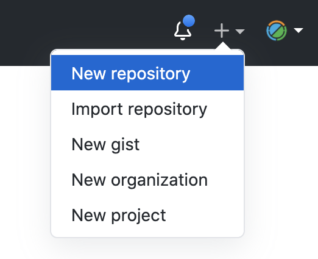
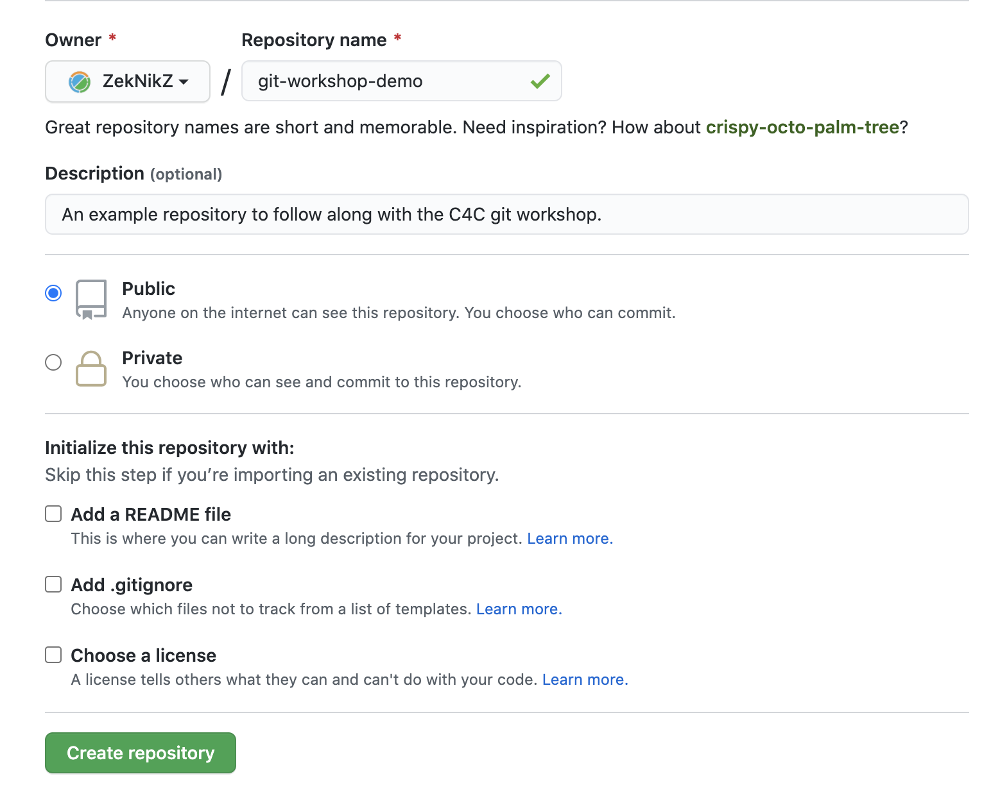
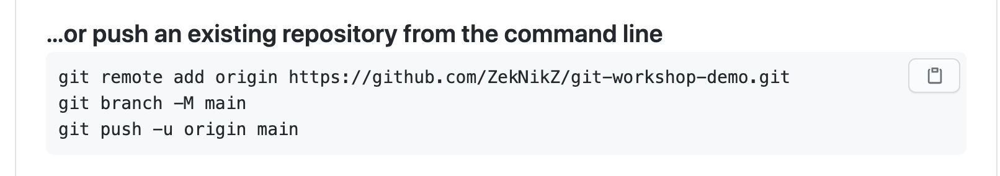
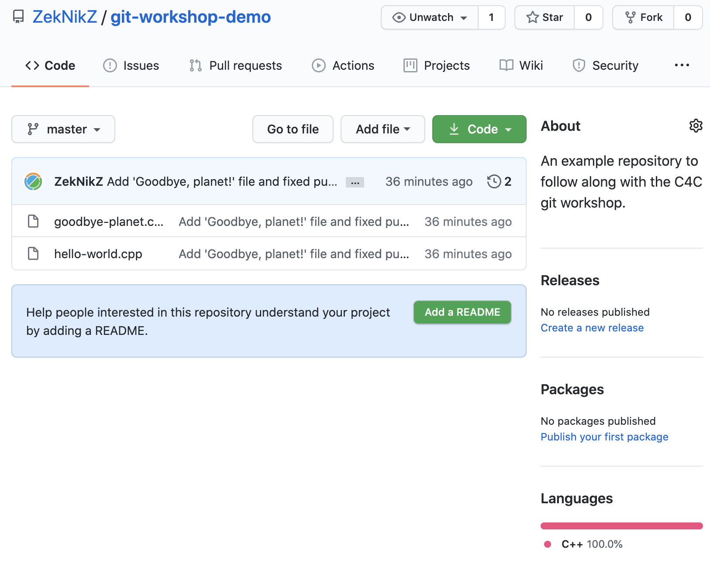

# `git` Workshop

_This workshop was originally designed for use for Computing for Compassion. Feel free to use or reference for your own purposes!_

_Revised October 2020._

## Table of Contents

<!-- START doctoc generated TOC please keep comment here to allow auto update -->
<!-- DON'T EDIT THIS SECTION, INSTEAD RE-RUN doctoc TO UPDATE -->
<details>
<summary>Table of Contents</summary>

- [Motivation for `git`](#motivation-for-git)
- [Key Terminology](#key-terminology)
- [Setting up `git`](#setting-up-git)
  - [Using the command-line](#using-the-command-line)
    - [Installing for macOS](#installing-for-macos)
    - [Installing for Windows](#installing-for-windows)
    - [Intial setup](#intial-setup)
  - [Using a `git` GUI](#using-a-git-gui)
    - [Pick a GUI](#pick-a-gui)
- [Creating a `git` repository](#creating-a-git-repository)
- [Our first commit](#our-first-commit)
- [Getting information before and after committing](#getting-information-before-and-after-committing)
  - [`git diff`](#git-diff)
  - [`git log`](#git-log)
  - [`git show`](#git-show)
- [Pushing to a remote](#pushing-to-a-remote)
  - [Creating a remote repository](#creating-a-remote-repository)
  - [Linking your local repo to the remote](#linking-your-local-repo-to-the-remote)
  - [`git remote`](#git-remote)
  - [`git push`](#git-push)
- [Collaboration using `git`](#collaboration-using-git)
- [Merging, Part I](#merging-part-i)

</details>
<!-- END doctoc generated TOC please keep comment here to allow auto update -->

## Motivation for `git`

[Back to Table of Contents](#table-of-contents)

TODO: 

## Key Terminology

[Back to Table of Contents](#table-of-contents)

A **Version Control System (VCS)** is a software tool that helps record changes to file(s) by recording individual modifications to files in an organized and easily-available way. It contains _all_ of the edits and history of each file.

In `git`, the basic atomic unit of work is called a **commit**. Commits are _snapshots_ of your file structure and contents at a particular point in time (this is in contrast to other VCSs, where basic records of changes are based on _diffs_ (will be described later on)).

Sets of commits are contained in **repositories** (**repos**, for short), which records the history of edits for a single project. There are two different types of repositories: **local repositories** and **remote repositories**. A local repository is the repository contained _on your local machine_. A remote repository, in contrast, is the history stored on an external machine, usually in the cloud somewhere (e.g., [GitHub](https://github.com/), [GitLab](http://gitlab.com/), [Bitbucket](https://bitbucket.org/)). Many local repositories (multiple computers, users, etc.) all link to usually one remote repository. For `git`, the local repository is stored in the `.git` folder in the project directory.

In `git`, there are four groups that a file (specifically, the changes to a file) can be in. The latter three are considered to be "tracked files" or, in other words, files that `git` is keeping tabs on.

- **Untracked Files**: files that have not yet been recognized by `git` and whose version histories are not being tracked.
- **Working Directory**: files that are being tracked by `git` but whose changes have not been staged yet.
- **Staging Area (Index)**: file changes that are "staged" (ready to commit).
- **History (Repository)**: committed file changes that are "permanent".

## Setting up `git`

[Back to Table of Contents](#table-of-contents)

### Using the command-line

The command-line is a powerful tool and allows you to have full control over your project. However, this comes with the drawback of not having other warning and error-checking information that a GUI could provide.

#### Installing for macOS

For macOS, I recommend installing `git` through `homebrew`:

1. If `homebrew` is not installed, open `Terminal.app` and copy-and-paste the following command:

```sh
/bin/bash -c "$(curl -fsSL https://raw.githubusercontent.com/Homebrew/install/master/install.sh)"
```

2. After `homebrew` is installed, run the following command:

```sh
brew install git
```

#### Installing for Windows

For Windows, simply go to the [download link](https://git-scm.com/download/win).

#### Intial setup

Run the following commands in your terminal / command prompt (replace your name and email accordingly).

```sh
git config --global user.name "Your Name"
git config --global user.email your.email.address@example.com
```

**Important note: the email address used here _must_ match the one used in your GitHub or GitLab account. Otherwise, the commits that you author will not be linked to your account.**

### Using a `git` GUI

GUIs are often preferred by beginners due to their simplicity and ease-of-use. However, they can be insufficient for common tasks.

#### Pick a GUI

I personally recommend either [GitHub Desktop](https://desktop.github.com/) or [Sourcetree](https://www.sourcetreeapp.com/). Note that they were built to integrate with GitHub and Bitbucket, respectively, but can be used with either.

## Creating a `git` repository

[Back to Table of Contents](#table-of-contents)

The command `git init` will initialize a `git` repository in the directory that you are in. Thus, if you want to initialize a project from scratch, first make a new directory and then run this command inside of it. If you are creating a repository from existing sources, just enter the folder and run `git init`.

_Follow along!_

```sh
mkdir git-workshop-1
cd git-workshop-1
git init
```

## Our first commit

[Back to Table of Contents](#table-of-contents)

Before we can commit any files, we have to create a file! Let's start there.

First, create a file called `hello-world.cpp`, seen below.

```c++
#include <iostream>

using namespace std;

int main() {
    cout << "hello world" << endl;

    return 0;
}
```

Next, run the command `git status` to see the status of the current project. You should get output like the following:

```
On branch master

No commits yet

Untracked files:
(use "git add <file>..." to include in what will be committed)

    hello-world.cpp

nothing added to commit but untracked files present (use "git add" to track)
```

Notice how `git` saw that `hello-world.cpp` has been created and that it is under the "Untracked files" category. This means that the file exists but that `git` has not started keeping track of changes to it.

Next, run the command `git add hello-world.cpp`. This causes the file to be **staged**. Running `git status` again will show this:

```
On branch master

No commits yet

Changes to be committed:
  (use "git rm --cached <file>..." to unstage)

	new file:   hello-world.cpp
```

`hello-world.cpp` has just moved from the **working directory** to the **staging area** or **index**. The staging area contains files that are about to be committed, in essense answering the question of "which file changes do I want to be recorded in the next snapshot?" Note that this command will _only move the current changes_ to the staging area. If you change the file again after `git add`ing it, you must run `git add` again.

Next, run `git commit -m "Initial commit"`. This command takes all of the "staged" changes and bundles them together into a single snapshot called a "commit". Note that, behind the scenes, what is really happening is that the previous commit (snapshot) is being editing according to the changes specified in the commit. The `-m` flag in the command specifies the **commit message**, a short description of the changes that occurred. In this case, we said "Initial commit" since this was the first commit to our repository.

When we run this command, we should see the following output:

```
[master (root-commit) d1fcb41] Initial commit
 1 file changed, 9 insertions(+)
 create mode 100644 hello-world.cpp
```

There is a lot of information here for us to see. First, we see the **branch** that we are on (`master`). We can also see the **short commmit hash** (the unique identifier of the commit). In my case, it is `d1fcb41`. Note that the actual commit hash is much longer! But, for simplicity, only the first 7 characters are shown as they are usually enough to uniquely identify the commit.

Now, if we run `git status`, we should see the following indicating that there are no more changes that are not committed or "saved" (i.e., the working tree (directory) is "clean"):

```
On branch master
nothing to commit, working tree clean
```

## Getting information before and after committing

[Back to Table of Contents](#table-of-contents)

Before we move on, I want to point out a few commands that come in handy.

First, create the file `goodbye-planet.cpp` as seen below:

```c++
#include <iostream>

using namespace std;

int main() {
    cout << "Goodbye, planet!" << endl;

    return 0;
}
```

Then, edit `hello-world.cpp` to change the `"hello world"` string to be `"Hello, world!"`.

### `git diff`

`git diff` is a command that will compare the versions of files. In its basic form, it will compare the _working directory_ to your _staging area and committed changes_. If we run `git diff` now, we will see the following:

```
diff --git a/hello-world.cpp b/hello-world.cpp
index 15b85dd..9155c1e 100644
--- a/hello-world.cpp
+++ b/hello-world.cpp
@@ -3,7 +3,7 @@
 using namespace std;
 
 int main() {
-    cout << "hello world" << endl;
+    cout << "Hello, world!" << endl;
 
     return 0;
 }
```

First notice that there is no mention of `goodbye-planet.cpp` here. That is because `goodbye-planet.cpp` is **untracked**, so, correspondingly, there is no information to compare against.

**`git` analyzes changes on a line-by-line basis**. This is seen by the fact that the line that we changed in `hello-world.cpp` is marked with a `-` and `+`. The `-` indicates the _previous_ version and the `+` indicates the _new_ version.

### `git log`

`git log` tells you about _all_ of the commits in your repository. Before we run this command, let's commit our changes using `git add .`. The `.` in this command refers to the _current directory_. Git then recursively searches through the file tree from this folder and looks for any files that have been changed.

Use `git add .` and then commit your changes. Commit messages should be consise and descriptive. A good message for this change could be `Add 'Goodbye, Planet!' file and fixed punctuation`.

After committing, run `git log` to see what you see:

```
commit 81687546714d7dcb7a1c7eba75ea2207f7126cdb (HEAD -> master)
Author: Matthew McCaskill <mattrmccaskill@gmail.com>
Date:   Sun Oct 18 13:21:01 2020 -0500

    Add 'Goodbye, planet!' file and fixed punctuation

commit d1fcb4137d79b92fdac864a7be1a3bcd93356275
Author: Matthew McCaskill <mattrmccaskill@gmail.com>
Date:   Sun Oct 18 12:35:04 2020 -0500

    Initial commit
```

Here we see each commit in _reverse chronological order_. We can also see the full 40-character commit hash, the author of the commit (which should be your name and email), the date and time of the commit, and the commit message.

Something else to notice is the `HEAD ->` on the first line. `HEAD` is a special name for the last commit on your current branch. In reality, it is a pointer to the latest commit on your currently-checked out branch (we will talk more about this later).

### `git show`

`git show` can be used to find out more information about a commit.

Running `git show` by itself will show you information about the previous commit, as seen below. Basically `git show` shows us _both_ the `git log` information _and_ the `git diff` information. Cool, right!

```
commit 81687546714d7dcb7a1c7eba75ea2207f7126cdb (HEAD -> master)
Author: Matthew McCaskill <mattrmccaskill@gmail.com>
Date:   Sun Oct 18 13:21:01 2020 -0500

    Add 'Goodbye, planet!' file and fixed punctuation

diff --git a/goodbye-planet.cpp b/goodbye-planet.cpp
new file mode 100644
index 0000000..4036788
--- /dev/null
+++ b/goodbye-planet.cpp
@@ -0,0 +1,9 @@
+#include <iostream>
+
+using namespace std;
+
+int main() {
+    cout << "Goodbye, planet!" << endl;
+
+    return 0;
+}
diff --git a/hello-world.cpp b/hello-world.cpp
index 15b85dd..9155c1e 100644
--- a/hello-world.cpp
+++ b/hello-world.cpp
@@ -3,7 +3,7 @@
 using namespace std;
 
 int main() {
-    cout << "hello world" << endl;
+    cout << "Hello, world!" << endl;
 
     return 0;
 }
```

In addition, you can use `git show [hash]` to see the information of a _specific_ commit. In my case, I run the command `git show d1fcb4137d79b92fdac864a7be1a3bcd93356275` (the commit hash of "Initial commit"):

```
commit d1fcb4137d79b92fdac864a7be1a3bcd93356275
Author: Matthew McCaskill <mattrmccaskill@gmail.com>
Date:   Sun Oct 18 12:35:04 2020 -0500

    Initial commit

diff --git a/hello-world.cpp b/hello-world.cpp
new file mode 100644
index 0000000..15b85dd
--- /dev/null
+++ b/hello-world.cpp
@@ -0,0 +1,9 @@
+#include <iostream>
+
+using namespace std;
+
+int main() {
+    cout << "hello world" << endl;
+
+    return 0;
+}
```

## Pushing to a remote

[Back to Table of Contents](#table-of-contents)

Remote repositories are what make `git` a powerful collaborative tool. Before we continue, we need to create a remote repository.

### Creating a remote repository

**Make sure you have an account created on GitHub for this next step.**

Create a new repository on GitHub by clicking the "+" button in the top-right corner.



Next, choose a meaningful name and description for your repository and click the "Create repository" button.



### Linking your local repo to the remote

GitHub has a great feature that gives you some commands for specific situations. In this case, we are going to run the commands in the "…or push an existing repository from the command line" section:



There are two commands of interest here: `git remote` and `git push`.

### `git remote`

First, run the following command, substituting where appropriate:

```sh
git remote add origin https://github.com/[GitHub username]/[repo name].git
```

You can simply copy the link from the GitHub page if you wish. This command will tell your local `git` repository that the remote repository named `origin` is the GitHub repo you just created. `origin` is the standard name referring to the main remote of your project. You will only need to do this once per project, per remote (you usually only have one remote anyway).

### `git push`

`git push` is the other important command here. `git push` takes all of your local commits and sends them to the remote repository for storage. You will need to do this any time that you want to update the remote repository (which is usually pretty often).

Run `git push`. You will likely see the following:

```
fatal: The current branch master has no upstream branch.
To push the current branch and set the remote as upstream, use

    git push --set-upstream origin master

```

Here, `git` is telling us that our local branch `master` has no "upstream" branch. An "upstream" branch is simply the remote branch which your local one will mirror.

Follow `git`'s advice and run the command: `git push --set-upstream origin master`. You should see the following afterwards:

```
Enumerating objects: 7, done.
Counting objects: 100% (7/7), done.
Delta compression using up to 8 threads.
Compressing objects: 100% (6/6), done.
Writing objects: 100% (7/7), 2.09 KiB | 2.09 MiB/s, done.
Total 7 (delta 0), reused 0 (delta 0)
To https://github.com/ZekNikZ/git-workshop-demo.git
 * [new branch]      master -> master
Branch 'master' set up to track remote branch 'master' from 'origin'.
```

This says that your `master` branch is now set up to track the `master` branch in the `origin` remote.

Open up GitHub to see if your code did indeed sync:



## Collaboration using `git`

[Back to Table of Contents](#table-of-contents)

By far, the most useful feature of `git` is its focus on collaboration. There are four main commands of interest here: `git clone`, `git push`, `git fetch`, and `git pull`.

- `git clone` sets up a new local repository which will track a specified remote.
  - Note: this is functionally equivalent to the following:
    - `git init`
    - `git remote add origin [url]`
    - `git pull`
- As you already know, `git push` will push the commits in your local repository to the remote repository.
- `git fetch` will grab information from the remote so that your local repository knows which of your branches are behind and which are ahead.
- `git pull` will "pull" in the commits from the remote into your local repository.

Let's see all of these in an example. We are going to create a second local repository tracking the same remote to simulate multiple users working on the same project.

First, open a new terminal/command prompt instance _in the directory which you want to contain the new local repository_. In my case, opened a terminal at the Destkop.

Next, run the following command to create a new local repository. You can again copy the URL from your repository page. The `[folder name]` refers to the name of the folder that you want to put your project into. In my case, I want to put it into a new folder called `git-workshop-2`.

```sh
git clone https://github.com/[GitHub username]/[repo name].git [folder name]
```

In my case, my command looked like this: `git clone https://github.com/ZekNikZ/git-workshop-demo.git git-workshop-2`.

Open up `git-workshop-2/` and you should see the two files from before! If so, it worked! **I recommend keeping both folders open and both terminal windows open for the remainder of the workshop. I will refer to the repositories as "local repository 1" (original), "local repository 2" (new), and "remote repository" for the remainder of this workshop.**

In **local repository 1**, create a new file called `test.txt`. Put whatever you want inside of it. Stage and commit this file. This is how I did it:

```sh
echo 'Hello, world!' > test.txt
git add .
git commit -m "collaboration test file"
```

Now, we will do a `git push`. This will push the change to the _remote repository_.

Now, in **local repository 2**, run `git fetch`. You should see something similar to this:

```
remote: Enumerating objects: 4, done.
remote: Counting objects: 100% (4/4), done.
remote: Compressing objects: 100% (1/1), done.
remote: Total 3 (delta 1), reused 3 (delta 1), pack-reused 0
Unpacking objects: 100% (3/3), done.
From https://github.com/ZekNikZ/git-workshop-demo
   8168754..267dc33  master     -> origin/master
```

This indicates that `git` pulled the commit from local repository 1 into your local repository 2. In fact, if you run `git fetch` again, you will not have any output this time. This is because there were no more changes to fetch.

Next, run `git pull`. This will pull in the new file `text.txt` to your local repository 2. Here is the expected output from `git pull`:

```
Updating 8168754..267dc33
Fast-forward
 test.txt | 1 +
 1 file changed, 1 insertion(+)
 create mode 100644 test.txt
```

When you run `git pull`, it gives you a summary of what has changed. In this case, we can see that `test.txt` was created. If you run `git pull` again, you will see `Already up to date.`, indicating that there were no changes this time.

Before we move on, let's run `git log` again. You should get output similar to the following:

```
commit 267dc33c259dcd168ef6a0a57ecb3c1e7e406c42 (HEAD -> master, origin/master, origin/HEAD)
Author: Matthew McCaskill <mattrmccaskill@gmail.com>
Date:   Sun Oct 18 14:39:23 2020 -0500

    collaboration test file

commit 81687546714d7dcb7a1c7eba75ea2207f7126cdb
Author: Matthew McCaskill <mattrmccaskill@gmail.com>
Date:   Sun Oct 18 13:21:01 2020 -0500

    Add 'Goodbye, planet!' file and fixed punctuation

commit d1fcb4137d79b92fdac864a7be1a3bcd93356275
Author: Matthew McCaskill <mattrmccaskill@gmail.com>
Date:   Sun Oct 18 12:35:04 2020 -0500

    Initial commit
```

Look closely at the first commit there. We see that the latest commit is the current `HEAD` of the `master` branch, the `origin/master` branch (the `master` branch in the `origin` remote), and the `HEAD` of the `origin` remote. We'll talk more about this later, but keep this in mind for now.

## Merging, Part I

[Back to Table of Contents](#table-of-contents)